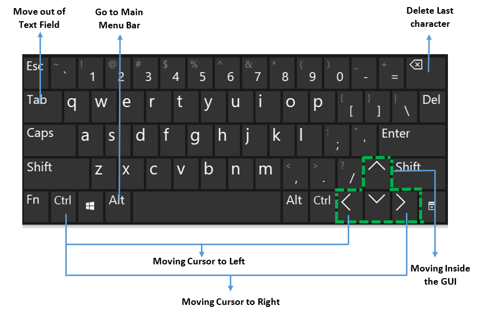

# Java Calculator Project
### Team Names
- Abdelrahman Yosry
- Aya Adel Gomaa
- Mohamed Hosny
- Nehal Amgad
- Yomna AL-Shaboury

### Link of Demo video: 
https://youtu.be/eb2qRVtGJRE

### Documentation Link:
https://github.com/abdelrahman-yousry/Java_Calculator_Project/blob/main/Documentation/CalculatorDoc.pdf

 

### Description
This is a desktop calulator based on Javafx. The calculator has five modes : Basic Mode, Scientific Mode, Base-N Mode, Conversion Mode, and Geometry Mode.

### 1-Basic mode
#### This mode performs simple arithmetic operations.

### 2-Base-N mode
#### This mode performs Base-N calculations besides basic calculations, it supports operations and conversions in modes. During the different modes, the unused buttons are disabled like in decimal only numbers and operations are enabled, in binary only one and zero numbers are enabled besides the operations buttons, same as for octal and hexadecimal, in octal numbers from one to seven are enable and operations, at the last mode all buttons are enabled.
For example, in the conversions: 
Binary -> Octal 
Binary-> Decimal
Binary -> Hex
 

### 3-Scientfic mode

#### This mode performs advanced calculations involving powers, roots, exponents, logarithms, trigonometry, and more. 

### 4-Geometry mode
#### Using this mode, user can convert mathematical units by just choosing any of the conversion types we provided him. And here are the conversion types the user can choose between:
•	Time
•	Currency
•	Temperature
•	Frequency
•	Data
•	Angle 
•	Length
•	Speed

### 5-Conversion mode
#### This mode is to calculate the area and the perimeter of those geometry shapes:
•	Circle 
•	Rectangle 
•	Square
•	Triangle
•	Rhombus
•	Parallelogram

### How to use it ?
#### In this project, we used two 4x4 Keypad to control all the modes and features in our calculator.
#### 	First Keypad: 
#### In this keypad we manage all the numbers from 0 – 9, dot operator, equal button and the basic operations + - / *  .

#### Second keypad

### Connection with arduino

## Keyboard shortcuts

### Libraries that we are used:
#### 1- Jssc 2.9.0 (for serial communication between java and arduino)
#### 2- json-simple-1.1 is To read the response from server
